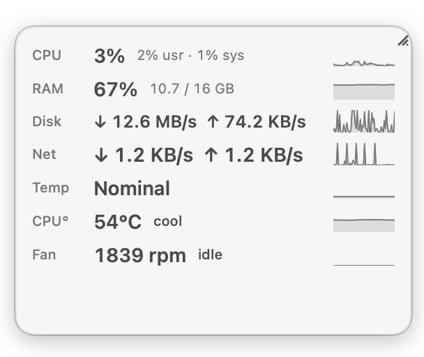
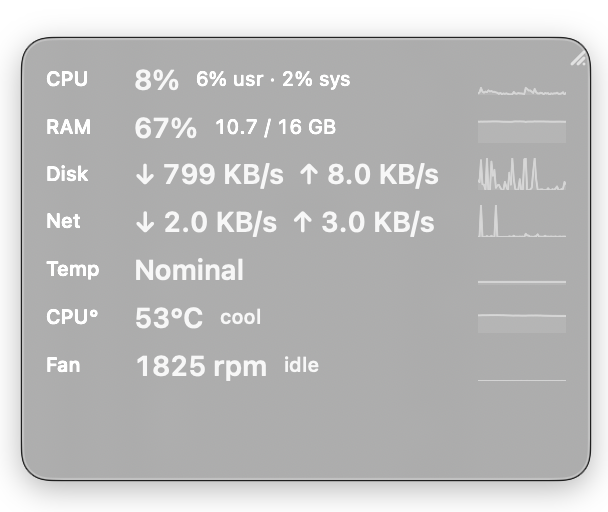

# Desktop Overlay


[](LICENSE)
[](https://github.com/alhanashi/Desktop-Overlay/releases/latest)

A tiny, native macOS floating panel that shows live system metrics — CPU, memory,
disk I/O, network throughput, thermal state, and (on Intel Macs) CPU temperature
and fan speed — always on top of your other windows, so you never need to open
Activity Monitor.

A lightweight, open-source alternative to iStat Menus / MenuMeters / Stats.

<p align="center">
  
  &nbsp;&nbsp;
  
</p>


- **100% native.** Swift + SwiftUI + AppKit. No Electron, no web view, no
  JavaScript, no Python, no bundled runtime, no third-party dependencies.
- **Local only.** Zero network connections, no database, no telemetry, no
  analytics. Every setting lives in `UserDefaults`.
- **Light.** ~0.3% CPU and ~45 MB RAM while idle (see [Performance](#performance)).
- **Public APIs only** — the one clearly-labelled, optional exception is the SMC
  sensor module for CPU °C / fan RPM (see [Known limitations](#known-limitations)).

---

## Requirements

| | |
|---|---|
| macOS | **15.0** or later (developed and tested on macOS 26, Intel) |
| Xcode | 16 or later (developed with Xcode 26.5) |
| Dependencies | None. Apple system frameworks only. |
| Signing | None for personal use — the app runs ad-hoc signed. App Sandbox is **off** (see [Known limitations](#known-limitations)). |

The Xcode project is generated from `project.yml` with
[XcodeGen](https://github.com/yonaskolb/XcodeGen), but the generated
`DesktopOverlay.xcodeproj` is committed, so **you do not need XcodeGen** to build
or run.

---

## Install

### Download the pre-built app

Grab `DesktopOverlay-x.y.zip` from the
[latest release](https://github.com/alhanashi/Desktop-Overlay/releases), unzip,
and move **DesktopOverlay.app** to `/Applications`.

The build is ad-hoc signed but **not notarized**, so on first launch macOS will
refuse to open it normally. Do this **once**:

- **right-click** the app ▸ **Open** ▸ **Open** in the dialog,

or from Terminal:

```bash
xattr -dr com.apple.quarantine /Applications/DesktopOverlay.app
```

After that it launches normally every time.

### Build it yourself — from Xcode

```bash
open DesktopOverlay.xcodeproj
```

Select the **DesktopOverlay** scheme and press **⌘R**.

### Build it yourself — install script

```bash
./Scripts/install.sh
```

Builds Release, copies the app to `/Applications`, ad-hoc signs it, removes the
quarantine flag, and launches it. Installing to a stable, signed location is what
lets **Launch at Login** register correctly.

`./Scripts/package.sh` produces `dist/DesktopOverlay-<version>.zip` for a release.

On first launch:

- the overlay appears immediately, centred on the main screen (~220×140 pt);
- a **gauge** icon appears in the menu bar;
- nothing appears in the Dock — the app is an accessory (`LSUIElement`).

---

## Using it

| Action | How |
|---|---|
| Move | Drag anywhere on the panel |
| Resize | Drag the grip in the bottom-right corner |
| Open Settings | Menu bar ▸ **Settings…** |
| Hide / show | Menu bar ▸ **Hide Overlay** / **Show Overlay** |
| Keep above everything | Menu bar ▸ **Always on Top** (on by default) |
| Let clicks pass through | Menu bar ▸ **Click Through** — the overlay becomes non-interactive until you turn it back off |
| Choose metrics | Menu bar ▸ **Metrics**, or Settings ▸ **Metrics** |
| CPU °C / fan RPM | Settings ▸ Metrics ▸ **Sensors (SMC)** — off by default, Intel Macs only |
| Refresh rate | Menu bar ▸ **Update Interval** (1 / 2 / 5 s) |
| Appearance | Menu bar ▸ **Appearance** (System / Light / Dark) |
| Start with macOS | Menu bar ▸ **Launch at Login**, or Settings ▸ General |
| Recenter if lost | Menu bar ▸ **Reset Position** |
| Learn what a value or word means | Settings ▸ **Guide** |

In **Normal** size the overlay also shows the raw figures behind the percentages
(`13.6 / 32 GB` for RAM, the user/system split for CPU) and a one-word status for
sensors (`cool` / `warm` / `hot`, `idle` / `moderate` / `high`). **Compact** size
drops those to keep the panel small.

Every setting — position, size, opacity, corner radius, font size, selected
metrics, update interval, appearance, always-on-top, click-through,
launch-at-login — persists across relaunches. Multi-display is handled: if a
saved position ends up off every screen, the overlay is recentred on the main
display.

---

## Performance

Measured on a 2019 MacBook Pro (8-core i9), overlay visible with 7 metrics at a
1-second interval:

| Resource | Cost |
|---|---|
| CPU, idle | **0.2–0.3 %** |
| Memory (RSS) | **~45 MB** |
| Threads | 7 |
| Network | **none** — zero sockets open |
| Disk writes | `UserDefaults` only, and only when a setting changes |

How it stays cheap:

- **One timer.** A single `DispatchSourceTimer` on a `.utility` queue (200 ms
  leeway) drives every metric. Nothing polls faster than the chosen interval.
- **Off-main sampling.** Collectors run on the background queue; the UI is touched
  once per tick with an immutable snapshot.
- **No idle rendering.** Sparklines are `Canvas`-drawn and repaint only when a new
  sample arrives — there is no animation loop.
- **Paused when hidden.** Hiding the overlay stops collection entirely.
- **Thermal backoff.** At `serious` / `critical` thermal state the interval is
  stretched ×2 / ×4 and sparkline updates pause — the app does *less* work when
  the Mac is hot.

The samples above were stable across repeated readings (no growth). A multi-hour
Instruments leak / energy run has not been done — contributions welcome.

---

## Architecture

```
DesktopOverlay/
├── App/          DesktopOverlayApp (@main), AppDelegate (lifecycle + wiring)
├── Overlay/      OverlayPanel (borderless NSPanel), OverlayWindowController,
│                 DraggableHostingView, ResizeHandleView,
│                 OverlayView / OverlayRowView / SparklineView
├── Metrics/      MetricValue, SystemMetric (protocol), MetricsCoordinator,
│                 CPUMetric, MemoryMetric, DiskMetric, NetworkMetric,
│                 ThermalMetric, BatteryMetric, SMCTemperatureMetric, FanMetric
├── Settings/     SettingsStore (UserDefaults — single source of truth),
│                 SettingsView (General / Appearance / Metrics / Update / Guide),
│                 SettingsWindowController
├── MenuBar/      MenuBarController (NSStatusItem + NSMenu, rebuilt on open)
├── Services/     SystemMetricsService (Mach / IOKit / POSIX wrappers),
│                 SMCService (optional SMC reader), LaunchAtLoginService
└── Utilities/    RingBuffer, RateCalculator, CPUCalculator, MemoryCalculator,
                  DecayingMax, OverlayGeometry, MetricFormatter
```

**Data flow**

1. `MetricsCoordinator` owns one background `DispatchSourceTimer`.
2. Each tick samples the enabled `SystemMetric`s off the main thread, builds an
   immutable frame, and hops to the main actor once to publish it.
3. SwiftUI views observe `MetricsCoordinator` and `SettingsStore` and re-render
   only on change.
4. Menu, overlay level, click-through and appearance react to `SettingsStore`
   through Combine.

**Testing.** The pure helpers (`CPUCalculator`, `MemoryCalculator`,
`RateCalculator`, `OverlayGeometry`, `RingBuffer`, the SMC value decoders) have no
I/O and are covered by **40 unit tests** in `DesktopOverlayTests/`:

```bash
xcodebuild -project DesktopOverlay.xcodeproj -scheme DesktopOverlay \
  -destination 'platform=macOS' test
```

---

## Metrics & where the numbers come from

| Metric | Source (all public unless noted) |
|---|---|
| CPU | Mach `host_statistics(HOST_CPU_LOAD_INFO)` — tick deltas |
| Memory | Mach `host_statistics64(HOST_VM_INFO64)`; pressure via `sysctl kern.memorystatus_vm_pressure_level` |
| Disk I/O | IOKit `IOBlockStorageDriver` `Statistics` — byte deltas |
| Network | `getifaddrs` `if_data` — byte deltas, loopback excluded |
| Temperature | `ProcessInfo.thermalState` — Nominal / Fair / Serious / Critical |
| CPU °C, Fan RPM | **SMC (undocumented)** — optional, off by default, Intel only |
| Battery | IOKit Power Sources (`IOPSCopyPowerSourcesInfo`) — optional |

---

## Adding a new metric

Example: a **Swap** metric.

1. **Identifier** — add a case to `MetricID` in `Metrics/MetricValue.swift`
   (`shortLabel`, `displayName`, and a spot in `displayOrder`).
2. **Raw reader** — add a function to `SystemMetricsService` returning the raw
   counters via a *public* API, `nil` on failure.
3. **Metric object** — create `SwapMetric.swift` conforming to `SystemMetric`.
   Keep the previous raw sample privately for delta values; put the pure math in a
   `Utilities/` helper so it can be unit-tested.
4. **Register** — add `.swap: SwapMetric()` to the `metrics` dictionary in
   `MetricsCoordinator`.
5. **Expose** — add a `Toggle` to `MetricsSettingsTab` in `SettingsView.swift`;
   it appears in the menu automatically (menu = `displayOrder` minus GPU).
6. **Display** — `OverlayRowView` / `MetricFormatter` already render
   `percent` / `bytes` / `bytesPerSecond` / `celsius` / `rpm` / `text`. Add a
   `shortDescription` line for the Guide.

Nothing else needs to change.

---

## Known limitations

Everything here is a deliberate consequence of using **public APIs only**.

| Metric | Public API status | What the app does |
|---|---|---|
| **Thermal state** | `ProcessInfo.thermalState` — public. | Shown as Nominal / Fair / Serious / Critical (default). |
| **CPU temperature (°C)** | No *documented* API. Readable from the SMC on Intel Macs via undocumented keys. | Optional **Sensors (SMC)** metric, **off by default**. Apple Silicon reports "unavailable". |
| **Fan RPM** | SMC only, undocumented. | Optional **Sensors (SMC)** metric, off by default. |
| **GPU usage** | No public API for system-wide GPU load. | Architecture-ready; the Settings toggle is disabled with an explanation. |
| **CPU frequency** | No reliable public API. | Not implemented. |
| **Battery** | `IOPSCopyPowerSourcesInfo` — public. | Implemented, off by default. Desktops report "unavailable". |
| **Disk I/O** | IOKit `IOBlockStorageDriver` — public, **but blocked by App Sandbox**. | App Sandbox is off. Re-enable it and the Disk row degrades to `—`; everything else still works. |

### The optional SMC sensor module

`Services/SMCService.swift` reads CPU temperature and fan speed from the System
Management Controller. This is **not a documented Apple API** — the 4-character
keys (`TC0P`, `F0Ac`, …) and their encodings (`sp78`, `fpe2`, `flt`) are
community-reverse-engineered, the same way iStat Menus, TG Pro and Stats do it.

- **Off by default.** Enable per metric in Settings ▸ Metrics ▸ *Sensors (SMC)*.
- **No special privileges.** No root, no SIP / Gatekeeper changes, no kext.
- **Intel only.** On Apple Silicon the classic keys are absent, so the metrics
  report "unavailable" and their toggles are disabled.
- **May break on a future macOS.** If a key stops responding the row shows `—`
  and nothing else is affected.
- **Isolated.** Delete `SMCService.swift`, `SMCTemperatureMetric.swift`,
  `FanMetric.swift` and the two `MetricID` cases, and the app is back to 100 %
  documented APIs.

The app makes **zero** network connections and stores nothing outside
`UserDefaults`.

---

## Creating a release

1. Set a real bundle identifier / Developer Team in `project.yml`, then
   `xcodegen generate`.
2. **Product ▸ Archive** (Release configuration).
3. Organizer ▸ **Distribute App ▸ Direct Distribution** for a Developer
   ID-signed `.app`.
4. For sharing with other Macs, notarize:
   ```bash
   xcrun notarytool submit DesktopOverlay.zip \
     --apple-id <id> --team-id <team> --password <app-specific-pw> --wait
   xcrun stapler staple DesktopOverlay.app
   ```
5. Package the `.app` or a DMG.

For personal use none of this is needed — `./Scripts/install.sh` is enough.

---

## Manual test checklist

Run through these after UI changes:

- [ ] Light / Dark / System appearance
- [ ] Retina and non-Retina displays
- [ ] Two or more displays; disconnect one → overlay returns to the primary screen
- [ ] Full-screen app in front → overlay stays visible, Dock / menu bar don't appear
- [ ] Drag to each screen edge; quit and relaunch → position restored
- [ ] Resize to the minimum and maximum
- [ ] Click Through on → clicks reach the app behind; off → overlay interactive again (toggle it a few times)
- [ ] Always on Top on / off changes whether other windows can cover the overlay
- [ ] Opacity, corner radius, font size, Compact / Normal all apply live
- [ ] Update interval 1 / 2 / 5 s changes the refresh rate
- [ ] Launch at Login on → appears in System Settings ▸ General ▸ Login Items
- [ ] Leave running for hours → CPU ≈ idle, memory flat, Energy = Low in Activity Monitor / Instruments

---

## License

MIT — see [`LICENSE`](LICENSE).
